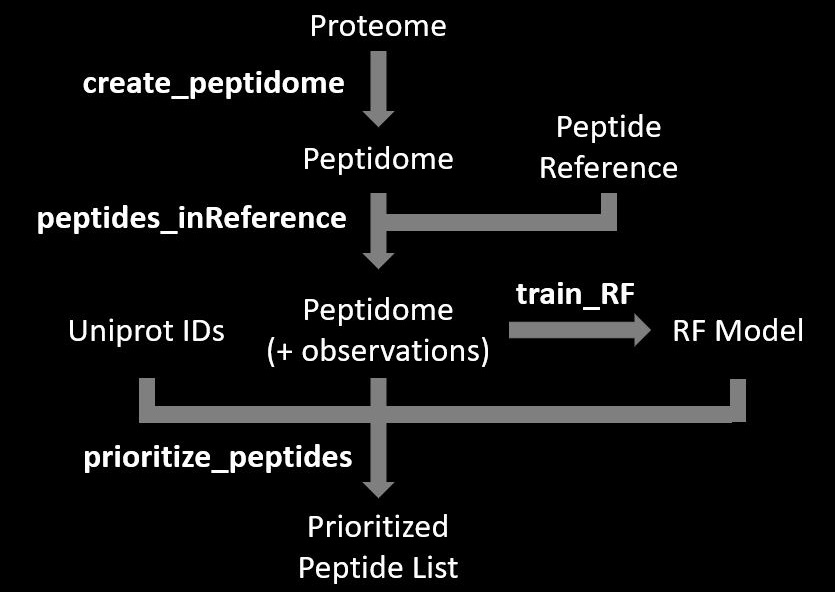

### Introduction

The `PeptideRanger` package contains a random forest (RF) classifier that predicts the detectability of peptides in mass spectrometry (MS). Detectability is predicted using sequence derived physiochemical features and independent of biological abundance. The package also contains tools to retrain the RF on datasets more relevant to experimental conditions, customize peptidomes, and select the top peptides for proteins of interest based on user provided priorities. 

<br>


### Overview of Package Functions 

Functions available in the `PeptideRanger` package:

* `create_peptidome()`: Creates a list of all unique tryptic peptides for a given proteome fasta file.

* `peptides_inReference()`: Adds peptide observation information from a reference/database to a peptidome.

* `train_RFmodel()`: Trains an RF classifier for peptide detectability predictions using database observations.

* `prioritize_peptides()`: Selects top n peptides for a list of target protein UniProt IDs based on RF scores and/or user provided priorities. 

* `peptide_predictions()`: Scores peptide sequences by MS detectability using input RF classifier. 

<br>



<br>


### Overview of Package Data

Data available in the `PeptideRanger` package:

* `CPTAC_exp_counts`: Dataframe of all peptides found in a 2021/02/18 download of the CPTAC database and the number of experiments they were observed in (column = `n_obs_pep`)

* `ProtDB_exp_counts`: Dataframe of all peptides found in a 2020/12 download of the ProteomicsDB database and the number of experiments they were observed in (column = `n_obs_pep`)

* `RFmodel_CPTAC`: Random forest classifier trained on the CPTAC database to predict peptide detectability.

* `RFmodel_ProteomicsDB`: Random forest classifier trained on the ProteomicsDB database to predict peptide detectability.

* `SwissProt2018_peptidome`: List of all unique peptides (peptidome) yielded from an in-silico tryptic digestion of a 2018/08/03 download of the human proteome from SwissProt. This digest includes peptides yielded from 0-2 missed cleavage (MC) events and in an amino acid range of 6-25 residues. 

* `SwissProt2018_peptidome_synth`: Filtered version of `SwissProt2018_peptidome` that does not include peptides that are challening to synthesize. This currently excludes peptides with N-term Q and E residues and with C-term P residues.

* `tm_peptides`: List of peptides that overlap with transmembrane domain sequences annotated in UniProt. 

<br>


### Installation

The `PeptideRanger` package can be installed using the `devtools` package.

```{r devtools download, eval = FALSE}
install.packages('devtools')
```

<br>


#### GitHub Installation

Direct installation from GitHub can be performed using:

```{r GitHub installation, eval = FALSE}
require(devtools)
install_github("rr-2/PeptideRanger")
```

<br>


#### Local Installation

The package can be cloned from the repository and installed locally using:

```{r local installation, eval = FALSE}
require(devtools)
install("./PeptideRanger")
```

<br>

<br>


### Workflow Examples

Load the `PeptideRanger` package. 

```{r load PeptideRanger, warning = FALSE}
library(PeptideRanger)
```

For these examples, a random sample of 100 protein UniProt IDs will be used to represent a list of target proteins of interest. 

```{r target prots}
set.seed("3284")
target_proteins <- sample(unique(PeptideRanger::SwissProt2018_peptidome$uniprot), 100)
```

<br>

<br>


#### Ex.1: Prioritize Peptides by RF Predictions

In this example, the top 5 peptides for each of the target proteins are selected based on RF detectability prediction scores. This demonstrates minimal usage of `PeptideRanger` in which a default RF classifier and peptidome provided in the pacakge are utilized and the only user input is the list of target proteins. 

```{r min use}
prioritized_peptides <- prioritize_peptides(uniprot_list = target_proteins,
                                            max_n = 5,
                                            peptidome = PeptideRanger::SwissProt2018_peptidome,
                                            prediction_model = PeptideRanger::RFmodel_ProteomicsDB,
                                            priorities = "RF_score",
                                            priority_thresholds = 0)
```

<br>

The output dataframe will contain the top 5 peptides for each target protein. For example, below are the top 5 peptides for UniProt ID: Q9UJX0

```{r min use output, echo = FALSE}
print(prioritized_peptides[prioritized_peptides$uniprot == "Q9UJX0",], row.names = FALSE)
```

<br>

<br>


#### Ex.2: Prioritize Peptides from a Novel Proteome

In this example, a novel proteome of interest is available and it is desired to generate a list of peptides to synthesize for application in a targeted quantification strategy that will be applied to the target protein list. The novel proteome could be an updated version of the human proteome, a proteome that includes non-canonical protein isoforms, or the proteome of a different organism. 

<br>

First, a peptidome must be generated from this new proteome. Given that the peptides are intended for synthesis, `synth_peps` is set to `TRUE`, meaning that peptides that are challenging to synthesize are filtered out of the peptidome. `aa_range` sets the size range of peptides retained in the peptidome while `missed_cleavages` sets the range of missed cleavage events peptides can result from.   

```{r novel peptidome hidden, echo = FALSE, warning = FALSE}
novel_peptidome <- create_peptidome(proteome_dir = "data/uniprot_homo_20180803_swissprot.fasta",
                                                   missed_cleavages = c(0,2),
                                                   synth_peps = TRUE,
                                                   aa_range = c(6,25))
```


```{r novel peptidome, eval = FALSE}
novel_peptidome <- create_peptidome(proteome_dir = "directory/to/novel_proteome.fasta",
                                    missed_cleavages = c(0,2),
                                    synth_peps = TRUE,
                                    aa_range = c(6,25))
```

<br>

The resulting dataframe contains a list of all unique tryptic peptides for this proteome, the uniprot ID and gene symbol of their parent protein, their start and end locations in their parent protein, their size, and the number of proteolytic missed cleavages they resulted from. For example, below are the first 10 peptides by start location for Uniprot ID: Q3T906

```{r novel peptidome results, echo = FALSE}
novel_peptidome <- novel_peptidome[novel_peptidome$uniprot == "Q3T906",]
print(novel_peptidome[1:10,], row.names = FALSE)
```

<br>

This peptidome can then be used directly as input to the `peptidome` parameter of the `prioritize_peptides()` function. In this example there is interest in selecting up to 10 peptides for each protein, and so `max_n = 10`.

```{r prioritize novel peptidome}
prioritized_peptides <- prioritize_peptides(uniprot_list = target_proteins,
                                            max_n = 10,
                                            peptidome = novel_peptidome,
                                            prediction_model = PeptideRanger::RFmodel_ProteomicsDB,
                                            priorities = "RF_score",
                                            priority_thresholds = 0)
```

<br>

Below are the top 10 peptides for UniProt ID: Q3T906 by RF detectability score.

```{r display results, echo = FALSE}
print(prioritized_peptides[prioritized_peptides$uniprot == "Q3T906",], row.names = FALSE)
```

<br>

<br>

#### Ex.3: Prioritize Peptides using a Novel Database and Multiple Priorities 

In this example, a new database of peptide observations in proteomics experiments with relevant technical conditions is available. Rather than use the RF trained on ProteomicsDB, which covers a diversity of mass spectrometers, labelling techniques, and experiment types, a predictor trained on this new database may be more specific to the experimental conditions being used. In this case, CPTAC is a large database of cancer proteomics experiments that all utilize tandem mass tags and orbitrap MS. Additionally, there are other priorities we would like to consider ahead of the RF detectability predictions, which include the presence of a peptide in a library of available synthetic peptides that have been previously used, and if the peptide is ubiquitous in the database (observed in >= 80% of all CPTAC experiments)

<br>

The example library of synthetic peptides will include 200 peptides randomly selected from the target proteins.

```{r}
synthetic_library <- dplyr::sample_n(PeptideRanger::SwissProt2018_peptidome_synth[PeptideRanger::SwissProt2018_peptidome_synth$uniprot %in% target_proteins,], 200)
```

<br>

The `peptides_inReference()` function is then used to merge the peptide experiment counts in CPTAC with the peptides in the peptidome. If a peptide in the peptidome is not observed in CPTAC, it is assigned an observation value of 0. 

* The column of peptides in the `pep_reference` dataframe must be labelled "sequence"
* `exp_counts_col`  must be set to the name of the column containing the number of observations or experiment counts in the database.
* `detection_freq = TRUE`: the frequency of appearance of each peptide will be calculated (n of experiments observed/total n database experiments).
* `detection_ratio = TRUE`: the detectability ratio of each peptide will be calculated (n of experiments observed/n of experiments parent protein observed).
* `reference_name` will be used as a  prefix label for all columns added to the peptidome by this function. 

```{r CPTAC peptidome}
CPTAC_peptidome <- peptides_inReference(peptidome = PeptideRanger::SwissProt2018_peptidome_synth,
                                        pep_reference = PeptideRanger::CPTAC_exp_counts,
                                        reference_name = "CPTAC",
                                        exp_counts_col = "n_obs_pep",
                                        detection_freq = TRUE,
                                        detection_ratio = TRUE)
```

<br>

Next, all peptides in the peptidome that are also found in the library of synthetic peptides will be flagged. Given that no `exp_counts_col` is specified, peptides will be labelled `TRUE` in the `synthetic_library` column if they are present in it, and `FALSE` if they are not. 

```{r}
CPTAC_peptidome <- peptides_inReference(peptidome = CPTAC_peptidome,
                                        pep_reference = synthetic_library,
                                        reference_name = "synth_library")
```

<br>

Below are the columns added to the peptidome, with 10 peptides from UniProt ID: O96019 used as an example. `CPTAC_ratio` will be used for training the new RF classifier while `CPTAC_freq` and `synth_library` will be used as priorities during selection of the top peptides.  

```{r, echo = FALSE}
output_peptidome <- CPTAC_peptidome[CPTAC_peptidome$uniprot == "O96019",]
output_peptidome$symbol <- NULL
output_peptidome$start <- NULL
output_peptidome$end <- NULL
output_peptidome$size <- NULL
output_peptidome$missed_cleavages <- NULL
output_peptidome$uniprot <- NULL
output_peptidome$CPTAC_n_obs_prot <- NULL

print(output_peptidome[1:10,], row.names = FALSE)
```


<br>

The `train_RFmodel()` function is then used to generate the CPTAC RF.

```{r, results = FALSE}
CPTAC_RFmodel <- train_RFmodel(peptidome = CPTAC_peptidome,
                               reference_name = "CPTAC")
```

<br>

Finally, the peptides are selected in order of the `priorities` parameter.
For each protein:

1. Peptides are selected if they are present (`TRUE`) in the `synth_library`
1. Peptides are selected in order of `CPTAC_freq` for those with a freq >= 0.8
1. Peptides are selected in order of `RF_score`

```{r}
peptide_list <- prioritize_peptides(uniprot_list = target_proteins,
                                    max_n = 5,
                                    peptidome = CPTAC_peptidome,
                                    prediction_model = CPTAC_RFmodel,
                                    priorities = c("synth_library", "CPTAC_freq", "RF_score"),
                                    priority_thresholds = c(TRUE, 0.8, 0))
```

<br>

Below is an example output for the UniProt ID: O96019. The first peptide has `synth_library = TRUE`, the next 2 peptides have `CPTAC_freq >= 0.8`, and the final 2 peptides have the next highest `RF_score`.

```{r, echo = FALSE}
output <- peptide_list[peptide_list$uniprot == "O96019",]
output$uniprot <- NULL
output$missed_cleavages <- NULL
output$CPTAC_n_obs_prot <- NULL
output$CPTAC_n_obs_pep <- NULL
output$size <- NULL
output$start <- NULL
output$end <- NULL
output$symbol <- NULL
print(output, row.names = FALSE)
```
All other peptidome columns such as size, start, end, and symbol are also retained in the dataframe of prioritized peptides, but are not shown here. 

<br>

<br>

<br>


### Function Examples 


### `peptide_predictions()`

<br>

The `peptide_predictions()` function scores peptide detectability using the input `prediction_model` for a list of peptide sequences. An example list of 10 peptide sequences (`peps_ofInterest`) will be randomly selected from the `SwissProt2018_peptidome`. 

```{r}
set.seed(7169)
peps_ofInterest <- dplyr::sample_n(PeptideRanger::SwissProt2018_peptidome, 10)
```

<br>


##### Ex.1: Single Peptide Input

```{r}
peptide_predictions(peptides = "PEPTIDERANGER",
                    prediction_model = PeptideRanger::RFmodel_ProteomicsDB)
```

<br>

##### Ex.2: Peptide List Input - Missed Cleavages Estimated

Missed cleavages are used a feature for the RF predictor. If they are not available, the function will estimate them based on the sequence (this will not recognize protein N-term Methionine residue cleavages).

```{r}
predictions <- peptide_predictions(peptides = peps_ofInterest$sequence,
                                   prediction_model = PeptideRanger::RFmodel_ProteomicsDB)
```

<br>

```{r, echo = FALSE}
predictions
```

<br>


##### Ex.3: Peptide List - Missed Cleavages Provided

If missed cleavages are available, they can be input as a list to the `missed_cleavages` parameter.

```{r}
predictions <- peptide_predictions(peptides = peps_ofInterest$sequence,
                                   prediction_model = PeptideRanger::RFmodel_ProteomicsDB,
                                   missed_cleavages = peps_ofInterest$missed_cleavages)
```

```{r, echo = FALSE}
predictions
```

<br>

<br>

### `create_peptidome()`

<br>

The `create_peptidome()` function takes the proteome fasta file directory directly as input and returns a dataframe of unique peptides resulting from an in-silico tryptic digestion. 

```{r, echo = FALSE}
fasta_directory <- "data/uniprot_homo_20180803_swissprot.fasta"
```

```{r, eval = FALSE}
fasta_directory <- "directory/to/human_proteome.fasta"
```

<br>

##### Ex.1: Default Parameters

A peptidome of unique peptides can be created by providing only a directory to the fasta file. In this case, default parameters will retain peptides resulting from 0-2 missed cleavages and in the range of 6-25 amino acids. 

```{r, results = FALSE}
peptidome <- create_peptidome(proteome_dir = fasta_directory)
```

<br>

The resulting peptidome dataframe will appear with the below columns:

```{r, echo = FALSE}
peptidome[1:10,]
```

<br>


##### Ex.2: Specified Size and Missed Cleavage Ranges

If desired, the number of missed cleavages and the amino acid range of peptides resulting from in-silico digestion can be specified, which may better suit a database being compared to. With `missed_cleavages = 0` only full digested peptides will be in the peptidome. 

```{r, eval = FALSE}
peptidome <- create_peptidome(proteome_dir = fasta_directory,
                              missed_cleavages = 0,
                              aa_range = c(7,25) )
```

<br>


##### Ex.3: Synthetic Peptides

If peptides are intended for synthesis, `synth_peps` can be set to `TRUE`, which filters out peptides with sequences that are challenging to synthesize. This currently includes peptides with N-term Q and E residues and C-term P residues.

```{r, eval = FALSE}
peptidome <- create_peptidome(proteome_dir = fasta_directory,
                              missed_cleavages = c(0,2),
                              aa_range = c(6,20),
                              synth_peps = TRUE)
```

<br>

<br>

### `peptides_inReference()`

<br>

The `peptides_inReference()` function adds information from a database or dataset to a peptidome. This is useful for flagging peptides in a list of interest, caclulating detectability ratios for training a RF, or calculating the frequency of peptide appearance in a database for use as a priority. 

<br>

##### Ex.1: Flag Transmembrane Peptides

The `peptides_inReference()` function can be used to flag peptides if they are present in a list. For example, `PeptideRanger::tm_peptides` dataframe contains a list of peptides that overlap with transmembrane domains annotated in UniProt. The column of peptides in the `pep_reference` dataframe must be labelled `sequence`.  

```{r}
peptidome <- peptides_inReference(peptidome = PeptideRanger::SwissProt2018_peptidome,
                                  pep_reference = PeptideRanger::tm_peptides,
                                  reference_name = "transmembrane")
```

<br>

Peptides in the peptidome that are present in `PeptideRanger::tm_peptides` are labelled `TRUE` in the `transmembrane` column. 

```{r, echo = FALSE}
output <- peptidome[peptidome$sequence %in% PeptideRanger::tm_peptides$sequence,]
output$symbol <- NULL
output$missed_cleavages <- NULL
print(output[1:10,], row.names = FALSE)
```

<br>


##### Ex.2: Prepare Peptidome for RF Training

The RF in `PeptideRanger` is trained to predict peptide detectability ratios (n observations of peptide/n observations of parent protein). Peptide observations from a database can be merged with a peptidome, and if `detection_ratio = TRUE` and the column of experiment counts (`exp_counts_col`) in the `pep_reference` is specified, detectability ratios and the number of parent protein observations will be calculated. 

```{r}
ProtDB_peptidome <- peptides_inReference(peptidome = PeptideRanger::SwissProt2018_peptidome,
                                         pep_reference = PeptideRanger::ProtDB_exp_counts,
                                         reference_name = "ProtDB",
                                         exp_counts_col = "n_obs_pep",
                                         detection_ratio = TRUE)
```

```{r, echo = FALSE}
output <- ProtDB_peptidome[1:10,]
output$missed_cleavages <- NULL
output$symbol <- NULL
output$start <- NULL
output$end <- NULL
output$size <- NULL
print(output, row.names = FALSE)
```

<br>

##### Ex.3: Calculate Frequency of Appearance in a Database

If `detection_freq = TRUE` and `exp_counts_col` is specified, then the function will merge the number of peptide observations to peptides in the peptidome and calculate the fraction of total experiments in the database that each peptide was observed in. 

```{r}
CPTAC_peptidome <- peptides_inReference(peptidome = PeptideRanger::SwissProt2018_peptidome_synth,
                                        pep_reference = PeptideRanger::CPTAC_exp_counts,
                                        reference_name = "CPTAC",
                                        exp_counts_col = "n_obs_pep",
                                        detection_freq = TRUE)
```

```{r, echo = FALSE}
output <- CPTAC_peptidome[1:10,]
output$missed_cleavages <- NULL
output$symbol <- NULL
output$start <- NULL
output$end <- NULL
output$size <- NULL
print(output, row.names = FALSE)
```


